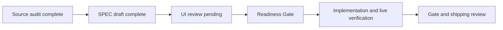
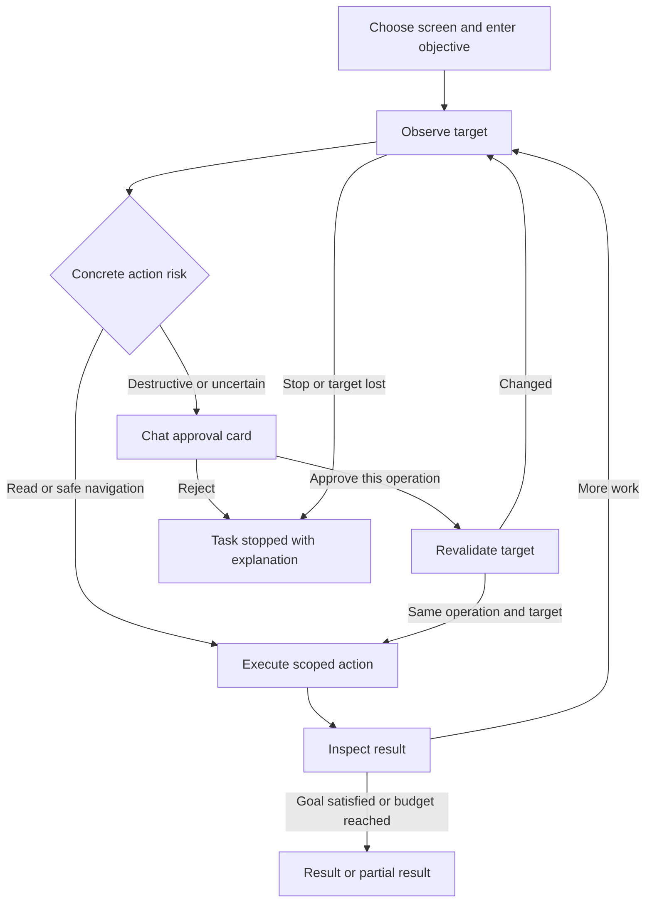

# Screen Agent: Objective and Approval UI (draft)

Feature: typesafe-computer-use · MODIFY_FEATURE · Revision 0

## Pipeline Progress



## User Flow



## Before: existing chat and watch

```text
┌ Chat ─────────────────────────────────────────────┐
│ Screen advice / assistant answer                  │
│ Generic suggested action                         │
│ [Action title]                                   │
│                                                  │
│ [Watch my screen] [Pin target] [Preset]            │
│ Status: watching / looking / off                  │
│ [Message…                              ] [Send]  │
└──────────────────────────────────────────────────┘
```

The current button sends a generic action payload. It is not a typed approval
bound to a pending operation, and there is no approve/reject state lifecycle.

## After: standing objective on the selected screen

```text
┌ Chat ─────────────────────────────────────────────┐
│ Target: Zoom — Weekly review                      │
│ Goal: 共有資料の決定事項を議事録にまとめて         │
│ [Objective…                         ] [Start]     │
│ Status: 画面の変化を確認中                 [Stop] │
│                                                  │
│ ミーティング支援 · Zoom                          │
│ 決定事項を議事録のドラフトに追加しました。         │
│ [Show notes]                                     │
│                                                  │
│ [Watch my screen] [Pin target] [Preset]            │
│ [Message…                              ] [Send]  │
└──────────────────────────────────────────────────┘
```

Start creates a session for the visible target and goal; it never starts from
a saved setting on launch. The existing watch switch keeps its observation
meaning. A standing objective adds action intent. Stop cancels the task and any
pending request, while ordinary chat remains available.

## After: approval inside the same chat thread

```text
┌ 承認が必要です ───────────────────────────────────┐
│ Goal: 共有資料をもとに議事録を更新する             │
│ Target: ~/Documents/weekly-notes.md                │
│ Operation: 既存ファイルを次の内容で置き換える       │
│ Consequence: 現在の内容が置き換わります。           │
│ [View proposed contents / diff]                   │
│                                                  │
│ [この操作を承認]                    [拒否]       │
│ Status: 承認待ち                                  │
└──────────────────────────────────────────────────┘
```

The card displays operation-specific details rather than a generic warning.
The buttons operate on a request ID held by the app, never on executable text.
No default button or timeout automatically grants approval. Approval is for this
operation once, not the whole task. Keyboard navigation and VoiceOver expose the
operation, target and distinct button actions. Existing chat visual styles are
retained; the mockups show structure, not a new theme.

## Result and state variations

| State | Visible behavior | Execution |
|---|---|---|
| Empty | Choose a target and enter an objective; Start disabled until valid | No action |
| Observing/planning | Selected target, goal and readable current activity; Stop enabled | One task at a time |
| Approval pending | Exact operation and target with Approve/Reject | No pending-operation dispatch |
| Approved | Card says "承認済み"; controls disabled; task says "対象を再確認中" | Revalidate before executing once |
| Rejected | Card says "拒否しました"; controls disabled | Task stops without executing |
| Target changed | Card says "対象が変わったため無効" | New decision/approval needed |
| Cancelled | Card and task say "停止しました" | Waiters released; no later input |
| Permission/model error | Specific unavailable permission/model and a settings link | Failed/partial; no silent fallback target |
| Completed | Useful answer or requested artifact, with observed evidence | No extra task input |
| Partial | Results plus inspected coverage and stop reason | Never claims exhaustive completion |

### Example search result

```text
Firefox の X で、5,000 views 以上の投稿を2件見つけました。
・@example_a — 「投稿本文…」 — 5K views [Post link]
・@example_b — 「投稿本文…」 — 12K views [Post link]
確認範囲: 6回のスクロール。追加の投稿が読み込まれず停止しました。
```

This is an illustrative fixture result, not an observation of a live X account.
Counts are associated with each post; likes/reposts are never used as views.

## Review focus

- Approve/Reject appears in the chat and authorizes one concrete operation.
- A standing objective gives screen observation action intent; Start and Stop are explicit.
- Results answer the actual request, including partial coverage rather than only a step trace.
- Shared meeting content cannot grant authority to execute or control another person's machine.

## Verdict

Pending. Choices: approve this SPEC/UI, request revision, or reject.
